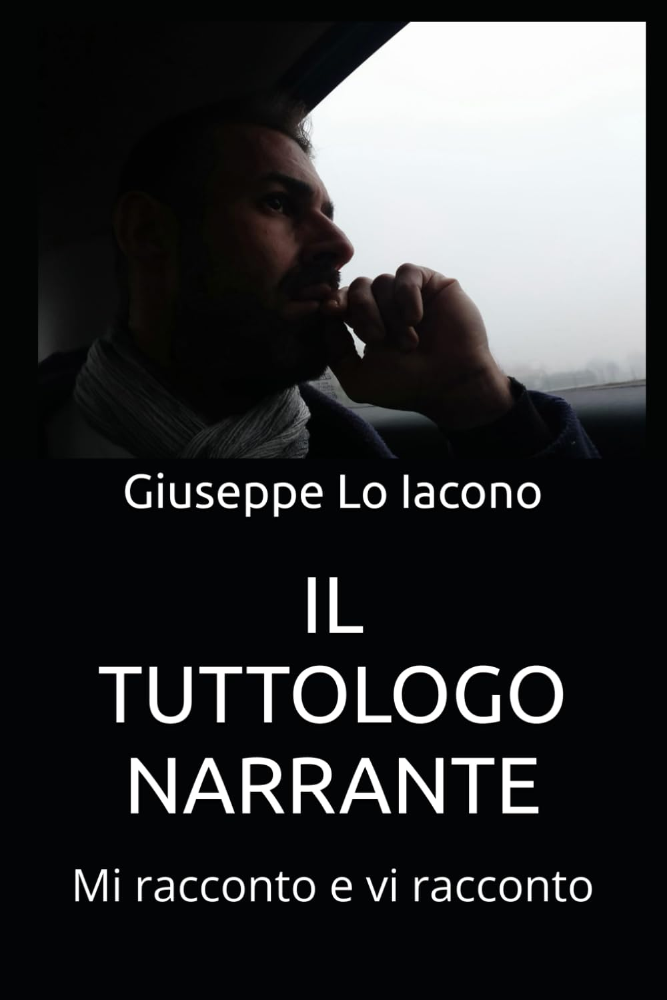

<section>
  <h2>📘 Il Tuttologo Narrante</h2>
  
  

    <em>Il Tuttologo Narrante</em> è una provocatoria esplorazione della disobbedienza civile, un viaggio attraverso le contraddizioni
    e le ingiustizie di un sistema che spesso offre soluzioni fallaci e ipocrite.
    Attraverso una narrazione incisiva e affilata, l’autore ci guida in un mondo dove le regole imposte dai governi
    vengono messe in discussione da chi ha il coraggio di ribellarsi a un ordine sociale che non sempre serve il bene comune.
      
    Il protagonista – un tuttologo che analizza con occhio critico le dinamiche politiche e sociali – offre spunti di riflessione
    sulle scelte che condizionano il nostro vivere quotidiano, mettendo in luce le disfunzioni del potere
    e le false promesse di chi dovrebbe proteggerci.
      
    Quest’opera non teme di sfidare le convenzioni: è un invito a riflettere sul vero significato di libertà, giustizia e verità.
    <strong>Il Tuttologo Narrante</strong> non è solo un libro, ma un manifesto di resistenza intellettuale.
    Un’esortazione a guardare oltre la superficie e a interrogarci sul nostro ruolo in una società distante dai bisogni reali delle persone.
  

  <a href="https://amzn.eu/d/9ujkmAk" class="button" target="_blank" rel="noopener">Acquista ora</a>
</section>
